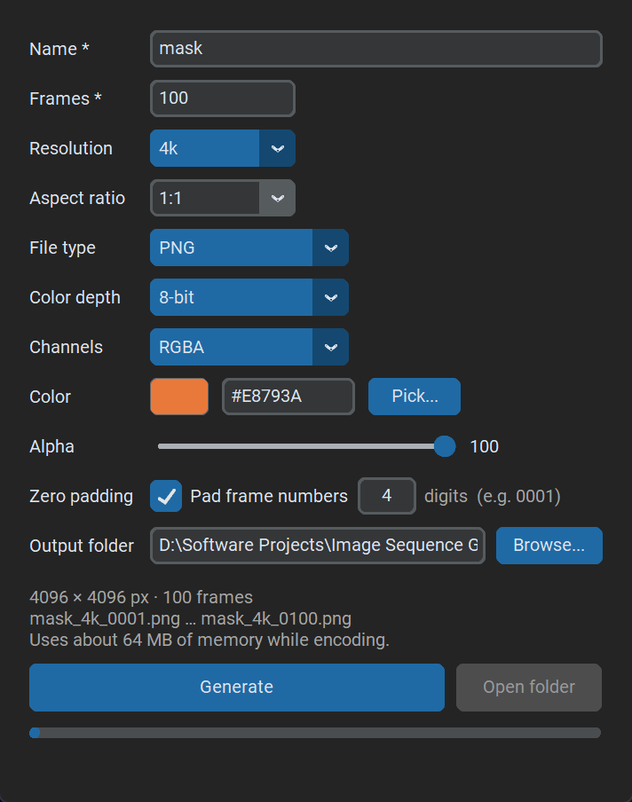

# Image Sequence Generator

A small Windows desktop app that generates **solid-color / blank image sequences** (PNG, JPEG or OpenEXR) in bulk. I built it for 3D texturing and compositing work in Blender, where you sometimes need a few hundred identical placeholder frames, masks or base layers with predictable file names.



## Features

- **PNG, JPEG and EXR** output, with 8-bit, 16-bit (PNG, EXR half float) and 32-bit float (EXR) depths.
- **Adjustable JPEG quality** (1–100) and **EXR compression** (ZIP, PIZ, DWAA, DWAB, HTJ2K, ZIPS, RLE, PXR24, or none), each shown only when that file type is selected.
- **RGB, RGBA or black & white** channels, a color picker with exact hex/RGB entry, and an alpha slider.
- **Resolution presets** (8k, 4k, 2k, 1k) with any aspect ratio, or a custom width × height.
- **Zero-padded frame numbers** (`0001`, `0002`, …) so Blender and other tools import the sequence in the right order.
- **Only valid options are offered.** The dropdowns change with the file type, so impossible combinations can't be selected: JPEG shows only 8-bit with RGB/BW, PNG has no 32-bit, EXR has no 8-bit.
- **Fast.** Every frame is identical, so the image is encoded once and the file is written N times. 100 frames of 8k RGBA take a couple of seconds, limited mostly by your disk.
- Progress bar, cancel button, overwrite confirmation, and checks for free disk space and memory.

## Get it running

### Option A: use the .exe (no Python needed)

1. Download `ImageSequenceGenerator.exe` from the [Releases page](../../releases) (or build it yourself, see below).
2. Put it anywhere and double-click it. No installer, no console window.

Notes:

- 64-bit Windows. Built and tested on Windows 11. If it fails to start with a missing-DLL error, install the Microsoft Visual C++ Redistributable.
- The first launch takes a few seconds, because the single-file exe unpacks itself to a temp folder each time it starts.
- The exe is **not code-signed**, so Windows SmartScreen may show "Windows protected your PC". Click **More info → Run anyway**. Some antivirus programs also flag PyInstaller-built exes; this is a known false positive for unsigned single-file builds.
- By default the output goes to an `output` folder **next to the exe**. Use **Browse...** to pick somewhere else.

### Option B: run from source

Developed and tested with Python 3.14 on Windows 11. Other recent Python 3 versions should work as long as NumPy, OpenCV and OpenEXR publish wheels for them. The app is Windows-only (the "Open folder" button and the build script use Windows features).

```powershell
git clone git@github.com:Voltfest42/Image-Sequence-Generator.git
cd Image-Sequence-Generator

python -m venv .venv
.\.venv\Scripts\activate
pip install -r requirements.txt

python app.py
```

### Option C: build the .exe yourself

```powershell
powershell -ExecutionPolicy Bypass -File build.ps1
```

This creates the virtual environment and installs the dependencies if needed, then uses PyInstaller to produce a single file at `dist\ImageSequenceGenerator.exe` (around 70 MB, since it bundles Python, NumPy, OpenCV and OpenEXR).

## Using it

| Field | Notes |
|---|---|
| **Name** * | Base file name. Cannot contain `< > : " / \ \| ? *`. |
| **Frames** * | Number of frames, 1–99,999. Digits only. |
| **Resolution** | 8k = 8192, 4k = 4096, 2k = 2048, 1k = 1024 on the *long* side, or **Custom** for an exact width × height (each up to 65,535). |
| **Aspect ratio** | `W:H`, for example `1:1`, `2:1`, `1:4`, `16:9`. Type your own or pick a preset. Disabled for Custom resolution. |
| **File type** | PNG, JPEG or EXR. |
| **JPEG quality** | JPEG only, 1–100 (default 95). Lower numbers give smaller files and visible artifacts. |
| **Compression** | EXR only. See the codec table below. Default ZIP. |
| **Color depth** | PNG: 8 / 16-bit. JPEG: 8-bit. EXR: 16-bit half float / 32-bit float. |
| **Channels** | PNG and EXR: RGB, RGBA, BW. JPEG: RGB, BW. |
| **Color** | Click the swatch or **Pick...** for the color picker, or type a hex code. |
| **Alpha** | 0–100. Only active for RGBA. |
| **Zero padding** | Untick for unpadded numbers (`1`, `2`, …, `10`). Otherwise 1–8 digits. The padding is never narrower than the frame count needs, so the numbers keep the same width. |
| **Output folder** | Created if it doesn't exist. |

Files are named `<name>_<resolution>_<number>.<ext>`, for example `mask_4k_0001.png` or `mask_1280x720_0001.exr`. The summary line under the form shows the exact first and last file names before you generate.

### Format notes

- **BW** is converted to grayscale using the luma weights `0.299 R + 0.587 G + 0.114 B`. In EXR it is written as a single `Y` channel.
- **EXR** alpha is written as straight (un-premultiplied) alpha.
- **PNG** files use compression level 6 (always lossless). **JPEG** files use the extension `.jpeg`.

#### EXR compression codecs

| Codec | Type | Notes |
|---|---|---|
| ZIP | Lossless | Good all-rounder (the default). |
| PIZ | Lossless | Best for noisy or grainy images. |
| ZIPS | Lossless | ZIP with one scanline per block. |
| RLE | Lossless | Fast; good for flat colors. |
| HTJ2K | Lossless | Newer codec; the reading software needs OpenEXR 3.4 or newer. Written with 256-line blocks. |
| PXR24 | Lossless at 16-bit, **lossy at 32-bit** | Float32 values are reduced to 24-bit precision. |
| DWAA | **Lossy** | Very small files. Colors can shift slightly, even for a solid color. |
| DWAB | **Lossy** | Like DWAA, but faster on large images. |
| None | Uncompressed | Very large files (an 8k 32-bit RGBA frame is about 1 GB). |

If you need the exact color you typed to survive, use one of the lossless codecs.
- Memory use while encoding is shown in the summary line. It is the size of one uncompressed frame, so a 32-bit RGBA 8k image needs about 1 GB.

## Development

```powershell
# unit tests (core logic: sizes, naming, padding, formats, pixel values, EXR precision)
.\.venv\Scripts\python.exe -m unittest discover -s tests

# GUI smoke tests (open real windows, so they need a display)
.\.venv\Scripts\python.exe tests\gui_smoke.py
.\.venv\Scripts\python.exe tests\picker_smoke.py

# check a built exe: writes a small sequence in every format, and opens the picker
.\dist\ImageSequenceGenerator.exe --selftest C:\some\empty\folder
```

| File | Purpose |
|---|---|
| `core.py` | Generation logic: validation, image creation, encoding, writing. No GUI code. |
| `app.py` | The CustomTkinter window and its dependent-option logic. |
| `picker.py` | The custom color picker dialog. |
| `build.ps1`, `make_icon.py` | Single-file exe build and icon generation. |
| `tests/` | Unit and smoke tests. |

## License

Released under the [MIT License](LICENSE).

Built with [CustomTkinter](https://github.com/TomSchimansky/CustomTkinter), [OpenCV](https://opencv.org/) (PNG/JPEG encoding), [OpenEXR](https://pypi.org/project/OpenEXR/), NumPy and Pillow, packaged with [PyInstaller](https://pyinstaller.org/).
